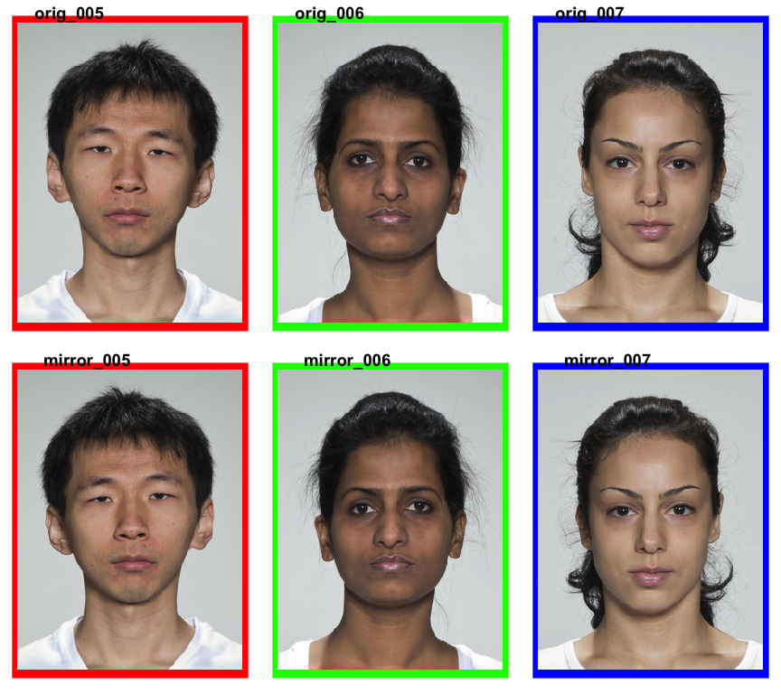

<!-- README.md is generated from README.Rmd. Please edit that file -->

# webmorph

<!-- badges: start -->

<!-- badges: end -->

The goal of webmorph is to integrate with
[webmorph.org](https://webmorph.org).

## Installation

You can install the development version from
[GitHub](https://github.com/) with:

``` r
# install.packages("devtools")
devtools::install_github("facelab/webmorph")
```

## Example

Load in all the tems from a directory. The code below loads images built
into webmorph from the CC-BY licensed [Young Adult Composite
Faces](https://doi.org/10.6084/m9.figshare.4055130.v1).

``` r
library(webmorph)

path <- system.file("extdata/test", package = "webmorph")
temlist <- read_tem(path)
```

You can plot an image with the `plot()` function.

``` r
plot(temlist, line.plot = TRUE)
```


## Reproducible stimulus construction

Load faces from the CC-BY licensed [Face Research Lab London
Set](https://doi.org/10.6084/m9.figshare.5047666.v3).

``` r
path <- system.file("extdata/london", package = "webmorph")

face_set <- read_tem(path)[5:7] %>%
  rename(prefix = "orig_", pattern = "_03", replacement = "")

stimuli <- face_set %>%
  mirror(frl_sym()) %>%
  rename(pattern = "orig", replacement = "mirror") %>%
  c(face_set, .) %>%
  resize(1/3) %>%
  crop(0.6, 0.8) %>%
  crop(1.05, 1.05, fill = rainbow(3)) 
```

Save your stimuli

``` r
write_tem(stimuli, dir = "mystimuli")
```

Easily create figures to illustrate your research.

``` r
plot(stimuli, nrow = 2)
```


