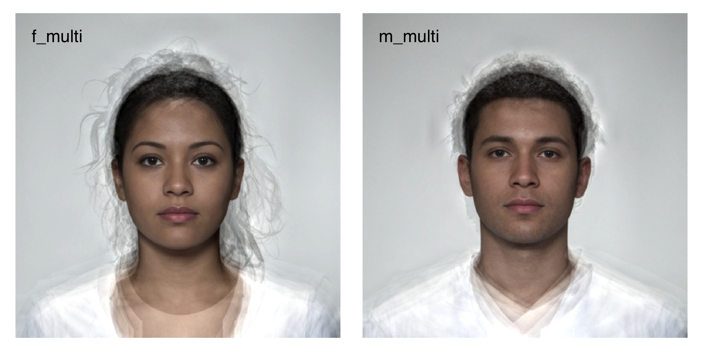
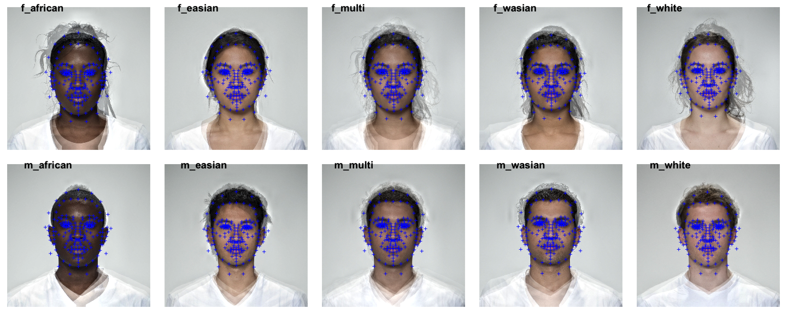
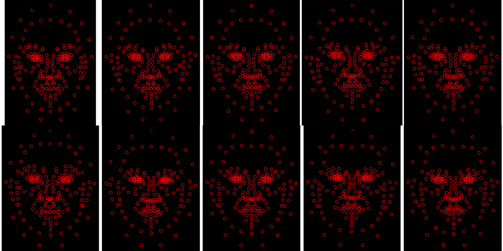
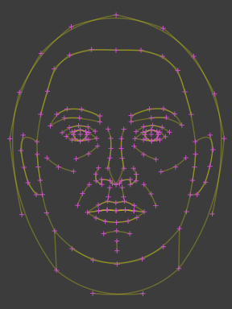

<!-- README.md is generated from README.Rmd. Please edit that file -->

# webmorph

<!-- badges: start -->

<!-- badges: end -->

The goal of webmorph is to integrate with
[webmorph.org](https://webmorph.org).

## Installation

You can install the development version from
[GitHub](https://github.com/) with:

``` r
# install.packages("devtools")
devtools::install_github("facelab/webmorph")
```

## Example

Load in all the tems from a directory. The code below loads images built
into {webmorph} from the CC-BY licensed [Young Adult Composite
Faces](https://doi.org/10.6084/m9.figshare.4055130.v1).

``` r
library(webmorph)
## basic example code

path <- system.file("extdata/composite", package = "webmorph")

temlist <- read_tem(path)
```

You can plot an image with the `plot()` function.

``` r
plot(temlist$f_multi, image = TRUE)
```



``` r
plot(temlist,
     color = "blue",
     image = TRUE,
     nrow = 2)
```



You can also visualise just the templates. If you omit the image and
don’t manually set a width and height, the x- and y-axis limit will be
set automatically.

``` r
plot(temlist, 
    color = "#FF0000",
    pt.size = 2,
    pt.shape = 1,
    bg.fill = "black",
    image = FALSE,
    nrow = 2)
```



You can average and visualise templates, as well. Set `line.plot` to
`TRUE` to visualise the lines as straight lines. Set `line.plot` to
“bezier” to see the really buggy bezier curves.

``` r
system.file("extdata/london", package = "webmorph") %>%
  read_tem(images = FALSE) %>%
  average() %>%
  plot(pt.colour = "orchid", 
       bg.fill = "grey30",
       line.plot = "bezier",
       line.colour = "yellow",
       line.alpha = 0.25,
       width = c(375, 975), 
       height = c(250, 1050)
  )
```


