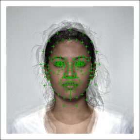

<!-- README.md is generated from README.Rmd. Please edit that file -->

# webmorph

<!-- badges: start -->

<!-- badges: end -->

The goal of webmorph is to integrate with
[webmorph.org](https://webmorph.org).

## Installation

You can install the development version from
[GitHub](https://github.com/) with:

``` r
# install.packages("devtools")
devtools::install_github("facelab/webmorph")
```

## Example

Load in all the tems from a directory. The code below loads images built
into {webmorph} from the CC-BY licensed [Face Resaerch Lab London
Set](https://doi.org/10.6084/m9.figshare.5047666.v3).

``` r
library(webmorph)
## basic example code

path <- system.file("extdata/demo", package = "webmorph")

tems <- read_tem(path, pattern = "00._03\\.tem")
```

You can plot an image with the `plot()` function.

``` r
plot(tems$`001_03`, image = TRUE)
```



``` r
plots <- lapply(tems, plot, 
                color = "blue",
                image = TRUE)

cowplot::plot_grid(plotlist = plots,
                   labels = names(tems))
```


You can also visualise just the templates. If you omit the image and
don’t manually set a width and height, the x- and y-axis limit will be
set automatically.

``` r
plots <- lapply(tems, plot, 
                color = "#FF0000",
                pt.size = 2,
                pt.shape = 1,
                bg.fill = "black",
                image = FALSE)

cowplot::plot_grid(plotlist = plots,
                   labels = names(tems))
```


