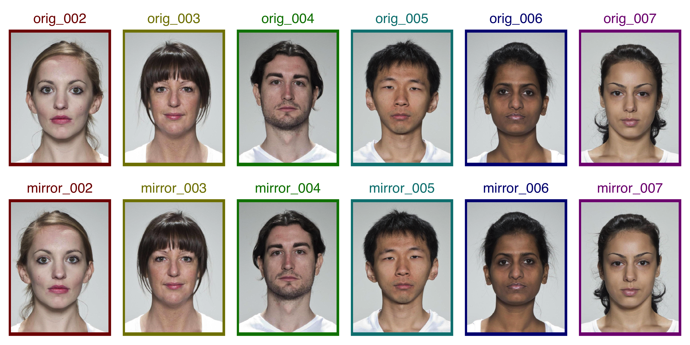

<!-- README.md is generated from README.Rmd. Please edit that file -->

# webmorphR

<!-- badges: start -->
<!-- badges: end -->

The goal of webmorphR is to integrate with
[webmorph.org](https://webmorph.org).

## Installation

You can install the development version from
[GitHub](https://github.com/) with:

``` r
# install.packages("devtools")
devtools::install_github("facelab/webmorphR")
```

## Example

Load in all the tems from a directory. The code below loads images built
into webmorphR from the CC-BY licensed [Young Adult Composite
Faces](https://doi.org/10.6084/m9.figshare.4055130.v1).

``` r
library(webmorphR)
#> 
#> ************
#> Welcome to webmorphR. For support and examples visit:
#> https://facelab.github.io/webmorphR/
#> ************
#> Logged in as user 1
#> Your projects are using 25 Gb of 100 Gb
#> You have all permissions for project 1

path <- system.file("extdata/test", package = "webmorphR")
stimlist <- read_stim(path)
```

You can plot an image with the `plot_fig()` function.

``` r
plot_fig(stimlist, 8, 4, label.position = "top left")
```


## Reproducible stimulus construction

Load faces from the CC-BY licensed [Face Research Lab London
Set](https://doi.org/10.6084/m9.figshare.5047666.v3).

``` r
face_set <- faces("london")[2:7]%>%
  rename(prefix = "orig_", pattern = "_03", replacement = "") %>%
  resize(1/3)

stimuli <- face_set %>%
  mirror(frl_sym()) %>%
  rename(pattern = "orig", replacement = "mirror") %>%
  c(face_set, .) %>%
  crop(0.6, 0.8) %>%
  crop(1.05, 1.05, fill = rainbow(6, v = 0.5)) 
```

Save your stimuli

``` r
write_stim(stimuli, dir = "mystimuli")
```

Easily create figures to illustrate your research.

``` r
plot_fig(stimuli, 12, 6, nrow = 2, border.width = c(0.2, 0, 0, 0),
         label.y = 1.12, label.size = 6, label.color = rainbow(6, v = 0.5))
```



If you have a
<a href="https://webmoprh.org" target="_blank">webmorph.org</a> account,
you can even make averages and transforms.

``` r
avg <- makeAvg(faces("london")[6:7], norm = "twopoint")
plot_fig(avg, 3, 3, labels = "")
```


