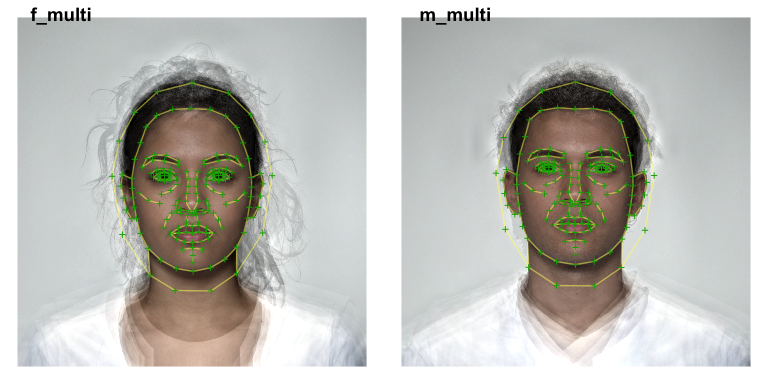
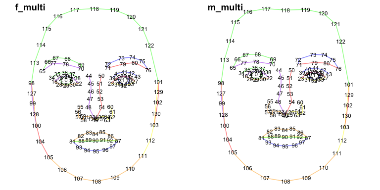
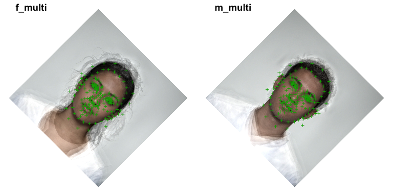
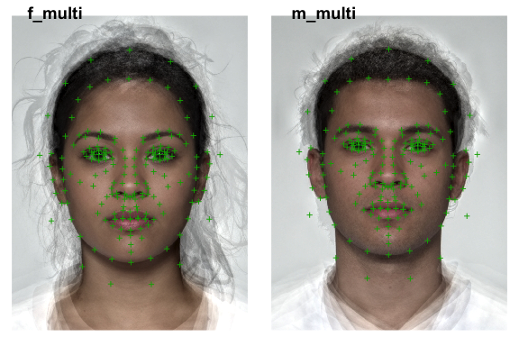
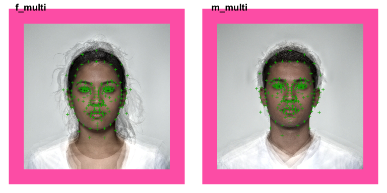
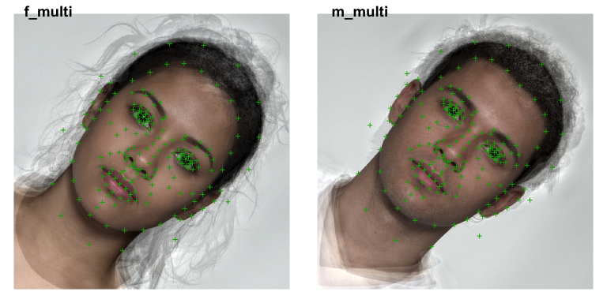
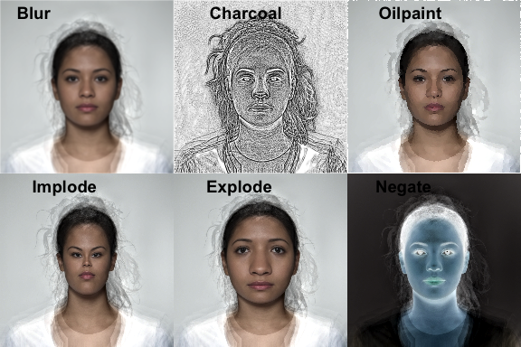

<!-- README.md is generated from README.Rmd. Please edit that file -->

# webmorph

<!-- badges: start -->

<!-- badges: end -->

The goal of webmorph is to integrate with
[webmorph.org](https://webmorph.org).

## Installation

You can install the development version from
[GitHub](https://github.com/) with:

``` r
# install.packages("devtools")
devtools::install_github("facelab/webmorph")
```

``` r
library(webmorph)
```

## Load your images

``` r
path <- system.file("extdata/composite/", 
                    package = "webmorph")

temlist <- read_tem(path, pattern = "multi\\.tem")
```

The lines are currently plotted as straight lines, but Lisa will add in
the proper bezier curves soon.

``` r
plot(temlist, images = TRUE, line.plot = TRUE)
```

<div class="figure">



<p class="caption">

Original Images and Templates

</p>

</div>

## Delete some points

``` r

remove_points <- frl_features("imprecise")
temlist %>%
  pt_delete(remove_points) %>%
  plot(pt.shape = "index", 
       pt.colour = "black", 
       line.plot = TRUE, 
       line.colour = c("red", "orange", "yellow", 
                       "green", "blue", "purple"))
```

<div class="figure">



<p class="caption">

Point removal

</p>

</div>

## Rotate

``` r
temlist %>%
  rotate(45) %>%
  plot(images = TRUE)
```

<div class="figure">



<p class="caption">

Rotated Images and Templates

</p>

</div>

## Crop

You can set the new width, height, x-offset and y-offset in pixels (must
be \> 2) or proportions.

``` r
temlist %>%
  crop(width = .6, height = .8, 
       x_off = .2, y_off = .1) %>%
  plot(images = TRUE)
```

<div class="figure">



<p class="caption">

Cropped Images and Templates

</p>

</div>

``` r
temlist %>%
  crop(width = 1.2, height = 1.2, 
       x_off = -0.1, y_off = -0.1,
       fill = "hotpink") %>%
  plot(images = TRUE)
```

<div class="figure">



<p class="caption">

Cropped Images and Templates

</p>

</div>

## Chaining

You can also chain image manipulation commands.

``` r
temlist %>%
  rotate(45) %>%
  crop(.5, .5, .25, .25) %>%
  plot(images = TRUE)
```

<div class="figure">



<p class="caption">

Manipulated Images and Templates

</p>

</div>

## Fun things

You can do some more fun things to the images (but not templates) with
the {magick} package that is installed with {webmorph}.

``` r
image <- temlist[[1]]$img

imglist <- list(
  magick::image_blur(image, radius = 10, sigma = 5),
  magick::image_charcoal(image, radius = 5, sigma = 2),
  magick::image_oilpaint(image, radius = 10),
  magick::image_implode(image, factor = 0.25),
  magick::image_implode(image, factor = -0.25),
  magick::image_negate(image)
)

labs <- c("Blur", "Charcoal", "Oilpaint", 
          "Implode", "Explode", "Negate")

lapply(imglist, magick::image_ggplot) %>%
  cowplot::plot_grid(plotlist = ., nrow = 2,
                     labels = labs)
```


