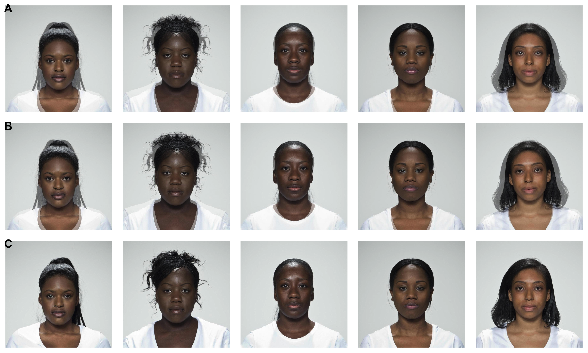

```{r setup, include = FALSE}
library("papaja")
library("webmorphR")
library("ggplot2")
library("patchwork")
r_refs("r-references.bib")

# Seed for random number generation
set.seed(42)
knitr::opts_chunk$set(
  cache.extra = knitr::rand_seed,
  out.width = "100%",
  echo = FALSE
)
```


## Introduction

People use face stimuli in research on face perception. This almost always involves some level of stimulus preparation to rotate, resize, crop, and center faces on the image. In addition, many studies systematically manipulate face images by changing colour and/or shape properties. Give some examples [@Little_2011]. 

* Visualise group differences
* Averageness
* Sexual dimorphism
* Symmetry
* Self-resemblance

Scope of this type of research. How many papers, what range of questions?

### Common Techniques

It was basically impossible to survey the literature about the methods used to create facial stimuli, in large part because of poor documentation.

#### Photoshop/Image editors

A search for "Photoshop face attractiveness" produced 6,450 responses in Google Scholar. Here are descriptions of the use of Photoshop from a few of the top hits.

> If necessary, scanned pictures were rotated slightly, using Adobe Photoshop software, clockwise to counterclockwise until both pupil centres were on the same y-coordinate. Each picture was slightly lightened a constant amount by Adobe Photoshop. [@Scheib_1999, p. 1914]

> For each face in the adapting set, we created two distortions using the spherize distort function in Adobe Photoshop: a −50% distortion, which compressed the center of the face, producing the appearance of a face in a concave mirror, and a +50% distortion, which expanded the center of the face, producing the appearance of a face in a convex mirror [@Rhodes_2003, p. 559]

>  Using Adobe Photoshop, Version 3.05 (1994), each photo was rotated (if necessary) and then cut vertically along the facial midline using the philtrum (the base of the nose) as a guide. For each LL image, a copy of the left half of the face was reversed horizontally and then pasted onto the actual left half of the photograph (as depicted in Figure 1). The same procedure was followed to obtain RR mirror-image depictions. [@Mealey_1999, p. 153]

> Averted gaze images were generated in Adobe Photoshop. The irises and pupils of each face were isolated using the path tool and horizontally shifted three pixels left and right to produce an averted-left and averted-right version of each face [@Ewing_2010, p. 324]


- [@Gronenschild_2009]
  
#### Commerical morphing 

* 831 Google Scholar responses for "fantamorph face"
* 158 Google Scholar responses for "WinMorph face"
* Many others: MorphThing (no longer available), xmorph, et. 

#### Codable Methods

* imagemagick
* Matlab
* Psychomorph
* WebMorph
  

### Reproducibility!

Why are reproducible stimulus construction methods important?

I once gave up on a research project once because I couldn't figure out how to manipulate spatial frequency in MatLab to make my stimuli look like those in a relevant paper. When I contacted the author, they didn't know how the stimuli were created because a postdoc had done it in Photoshop and didn't leave a detailed record of the method.

Reproducibility of stimuli is especially important for face stimuli because faces are sampled, so replications should sample new faces as well as new participants. The difficulty of creating equivalent face stimuli is a major barrier to this, resulting in stimulus sets that are used across dozens or hundreds of papers. 

* The Chicago Face Database [@CFD_2015] has been cited in almost 800 papers.
* Ekman POFA **selling** for [$399](https://www.paulekman.com/product/pictures-of-facial-affect-pofa/) for " 110 photographs of facial expressions that have been widely used in cross-cultural studies, and more recently, in neuropsychological research".
* Image sets are often private and reused without clear attribution (FRL and Perception Lab are particularly bad for this).

### Main techniques

#### Averaging


#### Transforming


## Methods

### Averaging

### Transforming


## Case Study

### London Face Set

We will use the open-source, CC-BY licensed image set, the Face Research Lab London Set [@FRL_London]. Images are of 102 adults whose pictures were taken in London, UK, in April 2012 for a project with Nikon camera. All individuals were paid and gave signed consent for their images to be "used in lab-based and web-based studies in their original or altered forms and to illustrate research (e.g., in scientific journals, news media or presentations)." 

```{r, eval = FALSE, fig.width = 17, fig.height = 6}
faces("london") %>%
  resize(300) %>%
  plot(labels = "", nrow=6)

ggsave("figs/london_set.png", width = 17, height = 6)
```

```{r, fig.cap = "The 102 neutral front faces in the London Face Set."}
knitr::include_graphics("figs/london_set.png")
```

Each subject has one smiling and one neutral pose. For each pose, 5 full colour images were simultaneously taken from different angles: left profile, left three-quarter, front, right three-quarter, and right profile. These images were cropped to 1350x1350 pixels and the faces were manually centered. The neutral front images have template files that mark out 189 coordinates delineating face shape for use with Psychomorph or WebMorph.

### Delineation

Default face template

Initial fit: 3-point delineation

How accurate do you have to be?

Simplified face templates.

Automatic delineation pros and cons.


```{r, fig.width = 4, fig.height = 4, out.width = "50%"}
demo <- faces("london", pattern = "025")
plot(demo, pt.plot = TRUE, 
     line.plot = TRUE, 
     line.color = "blue", labels = "")
```


### Normalisation

If your image set isn't highly standardised, you probably want to crop, resize and rotate your images to get them all in approximately the same orientation on images of the same size. There are several reproducible options, each with pros and cons. 

One-point alignment doesn't rotate or resize the image at all, but aligns one of the delineation points across images. This is ideal when you know that your camera-to-head distance and orientation was standard (or meaningfully different) across images and you want to preserve this in the stimuli, but you still need to get them all in the same position and image size. You can very quickly delineate the image set with a custom 1-point template.

Two-point alignment resizes and rotates the images so that two points (usually the centres of the eyes) are in the same position on each image. This will alter relative head size such that people with very close-set eyes will appear to have larger heads than people with very wide-set eyes. This technique is good for getting images into the same orientation when you didn't have any control over image rotation and camera-to-head distance of the original photos. You can very quickly delineate the image set with a custom 2-point template or just 3-point delineate the set with the default face template and don't bother moving any other points.

Procrustes alignment resizes and rotates the images so that each delineation point is as aligned as possible across all images. This can obscure meaningful differences in relative face size (e.g., a baby's face will be as large as an adult's), but can be superior to two-point alignment. However, this requires that the whole face be accurately delineated, but you can use a minimal template such as a face outline or the Face++ auto-delineation to achieve approximately the same result. While not available in webmorph, procrustes alignment is available in webmorphR. 

```{r norm, eval = FALSE, fig.width = 7.5, fig.height = 6}

subset <- faces("london", pattern = "(025|062|099|126|129)") %>%
  resize(600)
orig <- plot(subset, pt.plot = FALSE, labels = "", nrow = 1)

# one-point alignment
onept <- align(subset, pt1 = 55, pt2 = 55,
               x1 = 300, y1 = 300,
               fill = "dodgerblue") %>%
  plot(pt.plot = FALSE, labels = "", nrow = 1)

# two-point alignment
twopt <- align(subset, pt1 = 0, pt2 = 1,
               fill = "dodgerblue") %>%
  plot(pt.plot = FALSE, labels = "", nrow = 1)

# procrustes alignment
proc <- align(subset, pt1 = 0, pt2 = 1, procrustes = TRUE, fill = "dodgerblue") %>%
  plot(pt.plot = FALSE, labels = "", nrow = 1)

sections <- list(c("Original", "One-point", "Two-point", "Procrustes"))
orig / onept / twopt / proc + plot_annotation(tag_levels = sections)
  

ggsave("figs/aligned.png", width = 7.5, height = 6, scale = 2)
```

```{r, fig.cap = "Original images with different alignments. One-point alignment placed the bottom of the nose point in the centre of the image. Two-point alignment placed the eye centre points in the same position as the first image. Procrustes alignment moved all images to the most congruent position. A blue background was used to highlight the difference here, but normally a colour matching the image background would be used or the images would be cropped."}
knitr::include_graphics("figs/aligned.png")
```


### Masking

(effect in masc paper)

```{r, fig.width = 4, fig.height = 2}
# upload images and templates from a webmorph list to webmorph.org
#dirDelete("84877/subset")
wm_files <- fileUpload(subset, "84877/subset")

avg_tex <- makeAvg(wm_files, "avg_texture", texture = TRUE)
avg_notex <- makeAvg(wm_files, "avg_notexture", texture = FALSE)

c(avg_tex, avg_notex) %>% plot()
```


```{r, fig.width = 10, fig.height = 2, fig.cap = "Images masked to include face, ears and neck."}
read_stim("figs/masked") %>%
  plot(labels = "", nrow = 1)
```


### Averaging

Texture/no

### Symmetrising

```{r, eval = FALSE, fig.width = 10, fig.height = 6}
read_stim("figs/sym") %>% 
  plot(labels = c("A", "", "", "", "",
                  "B", "", "", "", "",
                  "C", "", "", "", ""), 
       nrow = 3)
ggsave("figs/sym.png", width = 10, height = 6)
```

```{r, fig.cap = "Images with symmetric shape and colour (A), symmetric colour only (B), and symmetric shape only (C)."}

```


Left-left and right-right mirroring is not recommended for investigating perceptions of facial symmetry. this is because this method typically produces unnatural images for any face that isn't already perfectly symmetric. For example, if the nose does not lie in a perfectly straight line from the centre point between the eyes to the centre of the mouth, then one of the mirrored halves will have a much wider nose than the original face, while the the other half will have a much narrower nose than the original face. In extreme cases, one mirrored version can end up with three nostrils. The method above preserves the individual's characteristic feature shapes and avoids the problem of having to choose an axis of symmetry on a face that isn't perfectly symmetrical.

** Image of LL/RR mirror, plus impossibility of choosing an axis of symmetry? **

### Sexual dimorphism transform

Continuum

### Self-resemblance transform


# Discussion

* head position in 2D images
  * morphometics
  * facefuns
* Natural vs standardised source images
  * right image for the question
* Averaging is N=1


\newpage

# References

We used `r cite_r("r-references.bib")` to produce this manuscript.

\begingroup
\setlength{\parindent}{-0.5in}
\setlength{\leftskip}{0.5in}

<div id="refs" custom-style="Bibliography"></div>
\endgroup
