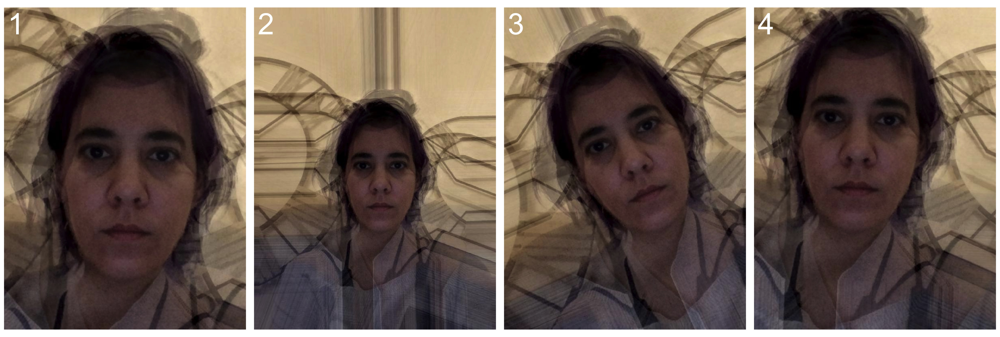

```{r, include = FALSE}
knitr::opts_chunk$set(
  collapse = TRUE,
  comment = "#>",
  fig.retina = 2,
  out.width = "100%"
)

# clean up test directory from last run
unlink("test", recursive = TRUE)
unlink("trans_test", recursive = TRUE)

starttime <- Sys.time()
```

```{r setup}
library(webmorphR)
```

## Log in 

You need to have an authorised user account at [webmorph.org](https://webmorph.org){target="_blank} to use the web integration functions. Log in before you use any of the functions.

```{r, eval = FALSE}
login(email = "test@gmail.com", password = "my big secret")
```

Ideally, you should put your login details in your `.Renviron` file and just use `login()` so you don't accidentally share your password. The easiest way to find your `.Renviron` file is by typing `usethis::edit_r_environ()` in the console. Add the following lines to the file.

```
WEBMORPH_EMAIL="test@gmail.com"
WEBMORPH_PASSWORD="my big secret"
```

Then webmorphR will automatically log you in when you load the library or use `login()`.

```{r}
login()
```

WebmorphR is pretty verbose to let you know how the package is interacting with the website. You can turn off webmorphR messages globally with the options:

```{r}
webmorph_options(verbose = FALSE)
webmorph_options(verbose = TRUE)
```


## Projects

Get your project list.

```{r, eval = FALSE}
projListGet()
```

`r knitr::kable(head(projListGet()))`

Set your project by ID.

```{r}
projSet(84877)
```
```{r, include = FALSE}
# secretly clean up some directories before we start
dirDelete("/twopoint_avg/")
dirDelete("/trans_test/")
```

Get the names of all files in a project (or a specified subdirectory) with the function `dirLoad()`

```{r}
dirLoad()
```

You can set or change your working project with `projSet()`. By default, this is set to your first project.

```{r}
projSet(84877)
```


## Download Files

Download the files from the "composites" directory. By default, they are saved in a directory named as the project ID, and have the same directory substructure, but you can also download them to a single named directory.

```{r}
dirLoad("composites") %>%
  fileDownload(destination = "test")
```

Now you can read in the stimuli to webmorphR.

```{r, fig.width = 10*2, fig.height = 4*2}
stimlist <- read_stim("test")

plot(stimlist, pt.plot = TRUE, line.plot = TRUE, nrow = 2)
```


## Create Averages

You can create averages with delineated images on the server. The example below shows how changing the order of the 4 files in the "lisa" directory changes the position of the average when using "twopoint" normalisation.

```{r}
f1 <- sprintf("/lisa/lisa%d.jpg", c(1, 2, 3, 4))
avg1 <- makeAvg(f1, "test/avg1", norm = "twopoint")

f2 <- sprintf("/lisa/lisa%d.jpg", c(2, 1, 3, 4))
avg2 <- makeAvg(f2, "test/avg2", norm = "twopoint")

f3 <- sprintf("/lisa/lisa%d.jpg", c(3, 1, 2, 4))
avg3 <- makeAvg(f3, "test/avg3", norm = "twopoint")

f4 <- sprintf("/lisa/lisa%d.jpg", c(4, 1, 2, 3))
avg4 <- makeAvg(f4, "test/avg4", norm = "twopoint")
```

Concatenate the resulting stimulus lists and plot them.

```{r, fig.width = 8, fig.height = 2.7}
averages <- c(avg1, avg2, avg3, avg4)

p <- plot(averages, labels = 1:4, nrow = 1, 
     label_size = 12, label_x = .05, label_colour = "white")
```


WebmorphR plots are just ggplots, so you can use `ggsave()` to save them to a file. You might need to set scale = 2 to match what you see after the R chunk when running interactively in RStudio (this is an RStudio bug that affects all plots).

```{r}
ggplot2::ggsave("fig/average_fig.jpg", plot = p, 
                width = 8, height = 2.7, scale = 2)

```

## Create Transforms

The function `makeTrans()` is structured like the batch transform files. The first 7 arguments are vectorised, so you can put in a vector of image names or shape/color/texture values.

For example, you can make a shape sexual dimorphism continuum by setting the shape argument as a vector.

```{r}
steps <- seq(-0.5, 0.5, .25)

sexdim <- makeTrans(trans_img = "/composites/f_multi.jpg",
                    from_img  = "/composites/f_multi.jpg",
                    to_img    = "/composites/m_multi.jpg", 
                    outname   = "test/dim",
                    shape     = steps, 
                    color     = 0, 
                    texture   = 0)
```


```{r, echo = FALSE, fig.width = 10, fig.height = 2}
plot(sexdim, nrow = 1,
     labels = paste0(steps * 100, "%"),
     label_x = 0.15, label_y = .9,
     label_size = 5,
     label_colour = "dodgerblue3")
```

Or you can transform a set of images. Non-image files will be ignored, so you can get the contents of a directory on webmorph.org with `dirLoad()`.

```{r}
comp <- dirLoad("composites")

outname <- comp[grepl("jpg$", comp)] %>%
  gsub("^/composites", "test/masc", .)

masc <- makeTrans(trans_img = comp,
                  from_img = "/composites/f_multi.jpg",
                  to_img = "/composites/m_multi.jpg", 
                  outname = outname,
                  shape = 0.5, 
                  color = 0, 
                  texture = 0)
```

```{r, echo = FALSE, fig.width = 10, fig.height = 4}
plot(masc, nrow = 2)
```


```{r}
dirLoad("templates") %>%
  fileDownload("test/templates")

# read one of the built-in batch templates
batch <- readr::read_tsv("test/templates/_batchTrans.txt", 
                         col_types = readr::cols())

b <- batchTrans(batch)
```

```{r, echo = FALSE, fig.width = 10, fig.height = 2}
plot(b, nrow = 1)
```

## Manage Files

You can upload these files to webmorph.org to use them in further morphs or transforms. Uploading files can take a long time, depending on server load, but you will see a progress bar in the console.

`fileUpload()` can take either a stimulus list or a vector of file paths, and optionally takes an upload directory (or is otherwise saved in the base directory of the active project).

```{r}
tp <- fileUpload(averages, "/twopoint_avg/")
```

You can't overwrite files on webmorph.org, so you might need to delete things sometimes.

You can delete individual files...

```{r}
fileDelete(tp[1:2])
```

...but it's usually more efficient and faster to delete an entire directory than individual files.

```{r}
# clean up uploaded directories
dirDelete("/twopoint_avg/")
dirDelete("/trans_test/")
```


```{r, echo = FALSE}
elapsed <- (Sys.time() - starttime) %>%
  as.numeric() %>%
  round(1)
```

This script took `r elapsed` minutes to render all the included images from scratch.
